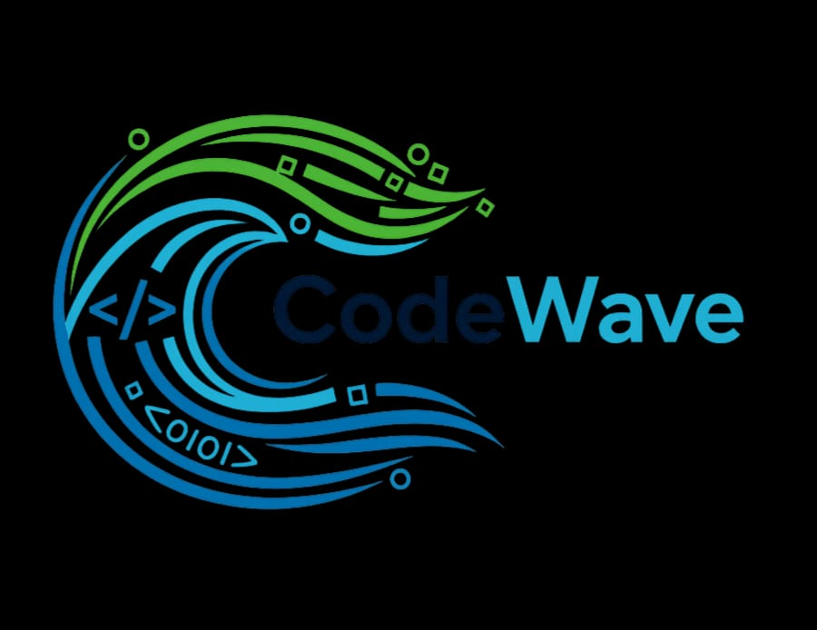

## API 1° SEMESTRE

### Projeto de Análise de Censo 2022 em São josé dos Campos

  
   

  <h1 align="center">
 
 
 
 
 
 
</h1>

### 🏅 Ojetivo 

  - Realizar uma análise detalhada dos dados do Censo 2022, focando exclusivamente na cidade de São José dos Campos.

  
###  🚀 Requisição do Cliente 
  - A Secretaria Municipal de Planejamento Urbano de São José dos Campos comunicou a equipe CodeWave para solucionar um problema.

  - Traduzir informações de maneira eficiente e clara para a tomada de decisões.
  

