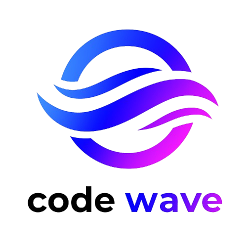

## API 1° SEMESTRE

### Projeto de Análise de Censo em São josé dos Campos

  
   

  <h1 align="center">
 
 
 
 
 
 
</h1>

 

> Status do Projeto: Em andamento! :hourglass_flowing_sand:

 

### :dart: Objetivo 

  :black_small_square: Realizar uma análise detalhada dos dados do Censo 2022, focando exclusivamente na cidade de São José dos Campos.

  
###  :medal_sports: Requisição do Cliente 

  :black_small_square: A Secretaria Municipal de Planejamento Urbano de São José dos Campos comunicou a equipe CodeWave para solucionar um problema.

  :black_small_square: Traduzir informações de maneira eficiente e clara para a tomada de decisões.

### 📋 Backlog do Produto

|      Rank      |    Prioridade   |                    User Story                           |    Estimativa   |  Sprint  | Status |
| :------------: | :-------------: | :-----------------------------------------------------: | :--------------:|  :-----: | :-----:|
|  1  | Alta  | Como secretário,quero de visualizar os gráficos prontos,para ajudar na resolução de problemas sociais .  | 8 | 1 |  ⏳ |
|  2  | Alta | Como secretário, quero um protótipo do site,para ter uma noção do projeto.  | 8 | 1 |  ⏳
|  3  | Alta  | Como secretário, quero  um resumo dos principais indicadores demográficos de SJC, para ter uma visão geral rápida.    | 3 | 1 |  ⏳         | 4 | Alta | Como secretário, quero um site funcional e bonito para apresentação.  | 3 | 1 |  ⏳
| 5 | Alta  |  Como secretário, quero visualizar gráficos com os dados populacionais por região, para comparar as duas.  | 13 | 1 |  ⏳
| 6 | Alta  |  Como secretário, quero visualizar um resumo executivo com os principais indicadores, para compartilhar com a prefeitura. | 8 | 2 |  ⏸️
| 7  | Medio  |Como secretário quero um site que contenha mapas interativos e com os dados que necessito,para ter um site mais interativo e acessivo. | 8 | 2 |  ⏸️
| 8 | Alta  | Como secretário, quero filtros laterais para selecionar regiões e indicadores, para personalizar minha análise.  | 13 | 2 |  ⏸️
| 9  | Baixo | Como secretário, quero uma navegação intuitiva entre as seções do site, para acessar facilmente todas as funcionalidades.    | 5 | 3 |  ⏸️
| 10 | Baixa  | Como secretário, quero ter uma página "Sobre" com a metodologia utilizada na pesquisa, para dar credibilidade aos dados.  | 5 | 3 |  ⏸️
| 11 | Baixa  | Como secretário , quero um Painel de ajuda contextual para me ajudar em cada seção do site.  | 2 | 3 |  ⏸️

### :mortar_board: Equipe

|      Membro      |    Função     |                            Github                            | 
| :--------------: | :-----------: | :----------------------------------------------------------: | 
|  Guilherme Oliveira  | Scrum Master  |  |
|  Hugo Leonardo  | Product Owner |  |
|  Elisa Mattos  | Desenvolvedor(a)  |  |                                                              |
| Yuri Souza | Desenvolvedor(a) |  |
| Maria Teresa | Desenvolvedor(a)  |  |
| João Vitor | Desenvolvedor(a)  |  |
| Altier Cruz  | Desenvolvedor(a)  |  |
| Felipe Batista | Desenvolvedor(a)  |  |

 

### :globe_with_meridians: Focal Point

| P²              | M²       |
| :-------------------: | :-----------: |
| <a href='https://buscatextual.cnpq.br/buscatextual/visualizacv.do'>Prof. Fernando Masanori Ashikaga</a> | <a href='http://lattes.cnpq.br/4723982029081265'>Prof.  Jean Carlos Lourenço Costa</a> |

  

